# 👟 Expo Marketplace Practice

Комплексний мобільний маркетплейс на **Expo SDK 54**, з фокусом на архітектуру, UI/UX та типізовану валідацію.

---

## 📌 Зміст
* [🟡 Міні-інформація](#info)
* [🚀 Tech Stack](#tech-stack)
* [🏗 Architecture](#architecture)
* [🗝 Key Features](#features)
* [📈 Development Progress (Milestones)](#milestones)
    * [🟢 Auth Validation & Refactoring](#new-commit)
    * [🔴 Navigation Overhaul & Architecture](#architecture-update)
    * [🔴 Firebase Auth Integration](#firebase-auth)
    * [🔴 UI Construction & Components](#ui-components)
    * [🔴 Initial Setup & Theme Fixes](#setup)
* [🖼 Скріншоти](#screenshots)

## 🟡 Міні-інформація
* 🟢 — Останній коміт.
* 🔴 — Попередні етапи розробки.
* 🟠 — Технічні примітки.
* Автоматична підтримка Dark/Light тем.

---

## 🚀 Tech Stack

*   **Framework:** Expo SDK 54 / React Native.
*   **Navigation:** Expo Router (File-based).
*   **Backend & Auth:** Firebase v12 (Email, Google Auth).
*   **Form Management:** React Hook Form.
*   **Validation:** Zod.
*   **Animation:** Reanimated.
*   **Language:** TypeScript.

## 🗝 Key Features

### 🔐 Authentication
*   Firebase Auth (Email/Password).
*   **Auth Guard:** Протекція маршрутів на основі стейту авторизації.
*   Persistent sessions (AsyncStorage).

### 🛡 Validation
*   Клієнтська валідація на Zod.
*   Візуальна індикація помилок в реальному часі.

### 🎨 UI & Theming
*   Кастомна бібліотека UI-компонентів.
*   Динамічна зміна кольорів (Dark/Light mode).

---

## 📈 Development Progress (Milestones)

### 🟢 [21.04.2026] Auth Validation & Refactoring

#### Опис
Впровадження клієнтської валідації форм із використанням **Zod** та **React Hook Form**.

#### Технічні деталі
*   **Validation:** Схеми для Login/Register у `schemas/authSchema.ts`.
*   **UI Integration:** Використання `Controller` для інпутів та відображення помилок.
*   **Features:** Додано екран обраного (`favorites.tsx`).
*   **Documentation:** Повна реструктуризація `README.md` та перехід до формату технічної документації.

#### Зміни у файлах
*   `schemas/authSchema.ts` (нова валідація).
*   `app/(auth)/login.tsx`, `register.tsx`, `forgot-password.tsx` (рефакторинг форм).
*   `README.md` (нова структура).

---

### 🔴 [19.04.2026] Navigation Overhaul & Architecture

#### Опис
Реструктуризація роутингу на базі **Expo Router Groups** та впровадження **Auth Guard**.

#### Технічні деталі
*   **Routing:** Групування `(auth)`, `(tabs)`, `(settings)`, `(support)`, `(profile-extra)`.
*   **Auth Middleware:** Логіка редиректів в роуті залежно від стану користувача.
*   **Colors:** Рефакторинг `Colors.ts` під універсальну палітру.

#### Зміни у файлах
*   `app/_layout.tsx` (Redirect logic).
*   `constants/Colors.ts` (Design system upgrade).
*   Створено кілька додаткових екранів-заглушок.

---

### 🔴 [17.04.2026] Firebase Auth Integration

#### Опис
Підключення **Firebase SDK** та реалізація глобального стейту авторизації.

#### Технічні деталі
*   **State:** Впровадження `AuthContext`.
*   **Persistence:** Налаштування `getReactNativePersistence` через `AsyncStorage`.
*   **Config:** Ініціалізація Firebase у `constants/firebase.ts`.

#### Зміни у файлах
*   `context/AuthContext.tsx`.
*   `constants/firebase.ts`.

---

### 🔴 [16.04.2026] UI Construction & Components

#### Опис
Розробка базової бібліотеки UI-компонентів та конфігурація збірки.

#### Технічні деталі
*   **Components:** Створення `AppButton` та `BackButton` з кастомними стилями.
*   **EAS:** Початкова конфігурація `eas.json` для Android/iOS збірок.

#### Зміни у файлах
*   `components/ui/AppButton.tsx`.
*   `app/(auth)/success.tsx`.

---

### 🔴 [15.04.2026] Initial Setup & Theme Fixes

#### Опис
Ініціалізація проєкту, видалення зайвого шаблону та виправлення рендерингу тем.

#### Технічні деталі
*   **Fix:** Усунення білих блоків під текстом у світлій темі.
*   **Cleaning:** Видалення дефолтних файлів з `tabs@54` шаблону.
*   **Routing:** Налаштування базового `Stack` роутера.

#### Зміни у файлах
*   `app.json`, `package.json`.
*   `.gitignore`, `tsconfig.json`.

---

## 🖼 Скріншоти

### 🔐 Authentication Flow
<table>
    <tr> 
        <td align="center"><b>Login Dark</b></td> 
        <td align="center"><b>Login Light</b></td> 
        <td align="center"><b>Register Dark</b></td> 
        <td align="center"><b>Register Light</b></td> 
    </tr> 
    <tr> 
        <td>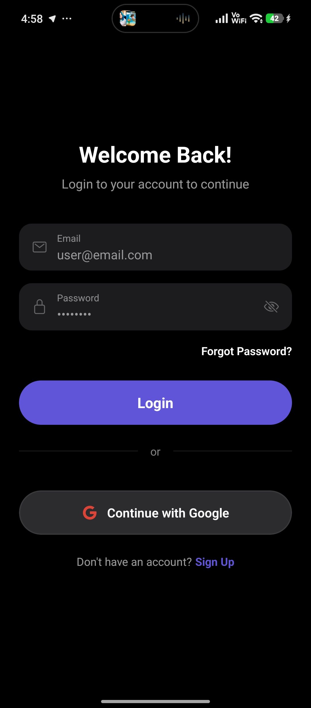</td>
        <td>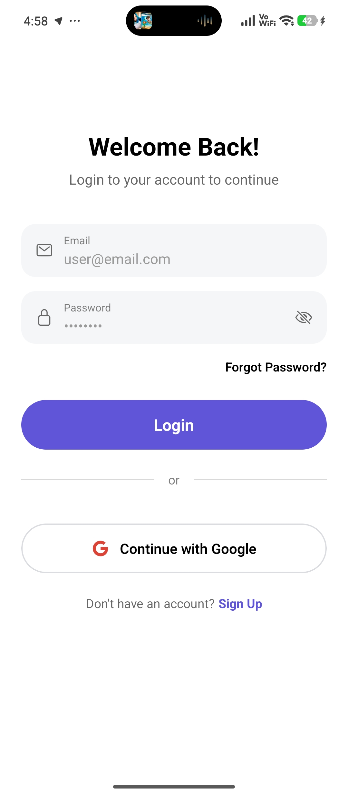</td>
        <td>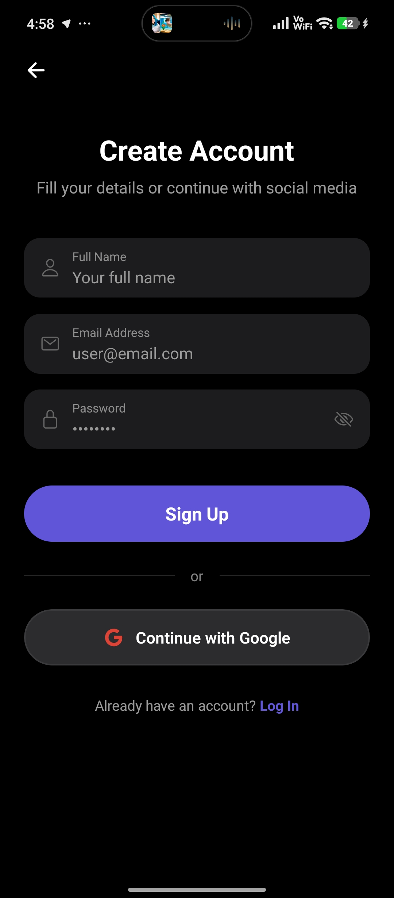</td>
        <td>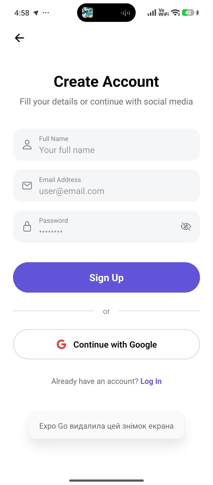</td>
    </tr>
    <tr>
        <td align="center"><b>Forgot Password Dark</b></td>
        <td align="center"><b>Forgot Password Light</b></td>
        <td align="center"><b>Success Dark</b></td>
        <td align="center"><b>Success Light</b></td>
    </tr>
    <tr>
        <td></td>
        <td>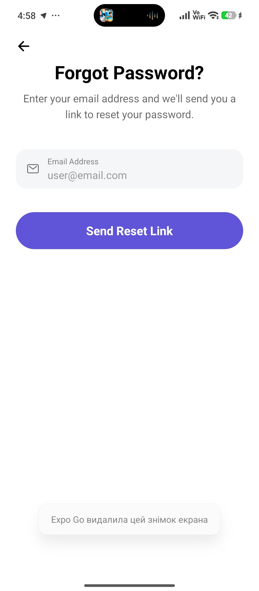</td>
        <td>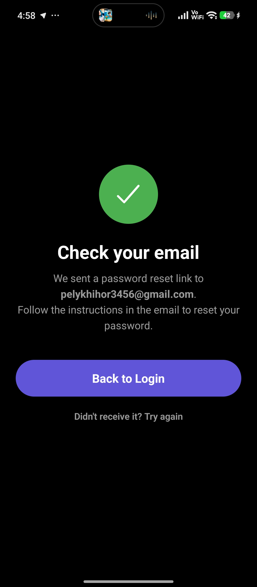</td>
        <td>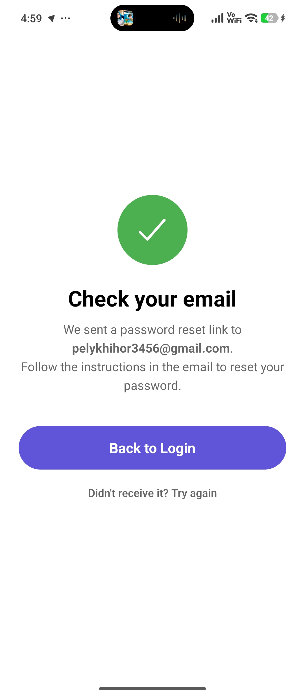</td>
    </tr>
</table>

### 👤 Profile & Details
<table>
    <tr> 
        <td align="center"><b>Profile Dark</b></td> 
        <td align="center"><b>Profile Light</b></td> 
        <td align="center"><b>Profile Details Dark</b></td> 
        <td align="center"><b>Profile Details Light</b></td> 
    </tr> 
    <tr> 
        <td>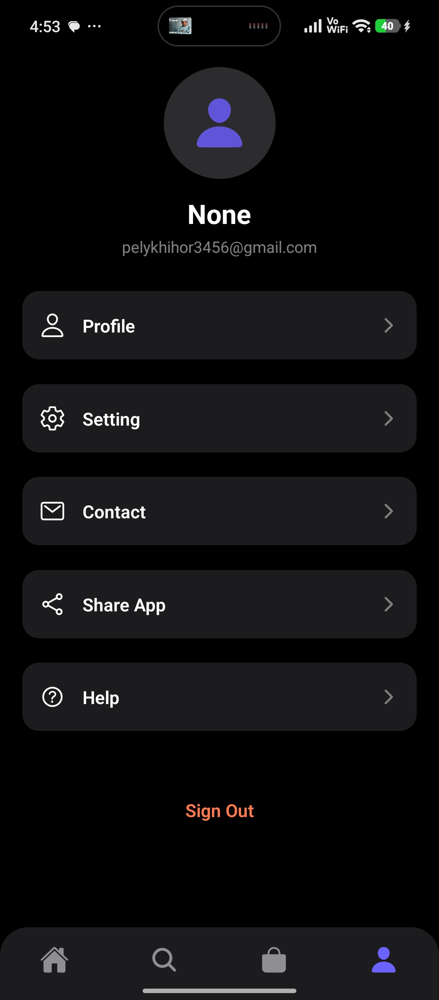</td>
        <td>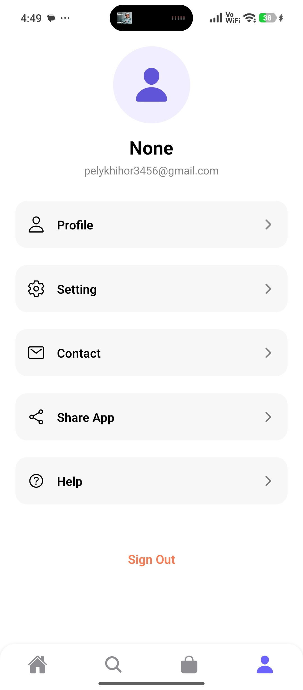</td>
        <td></td>
        <td>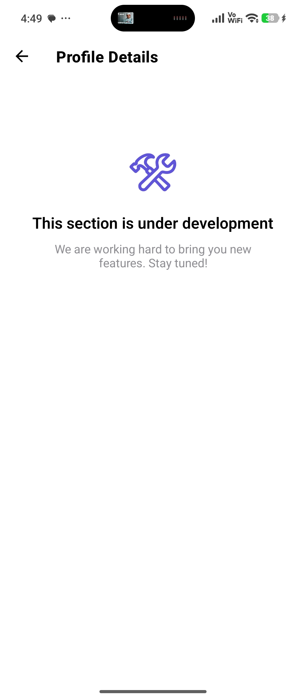</td>
    </tr>
</table>

### ⚙️ Settings & Support
<table>
    <tr> 
        <td align="center"><b>Settings Dark</b></td> 
        <td align="center"><b>Settings Light</b></td> 
        <td align="center"><b>Notifications Dark</b></td> 
        <td align="center"><b>Notifications Light</b></td> 
    </tr> 
    <tr> 
        <td>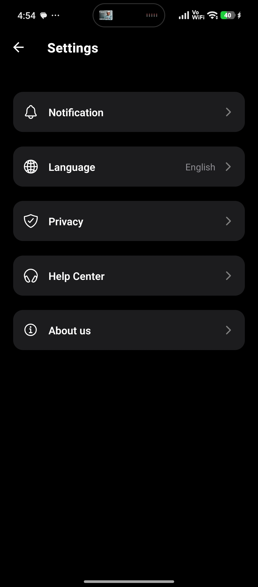</td>
        <td>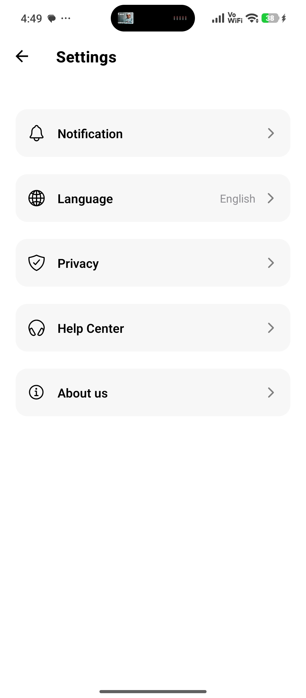</td>
        <td>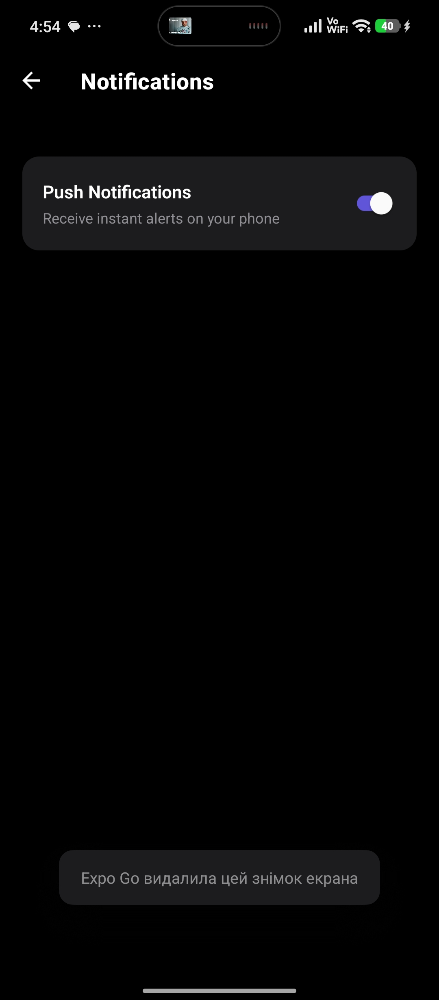</td>
        <td>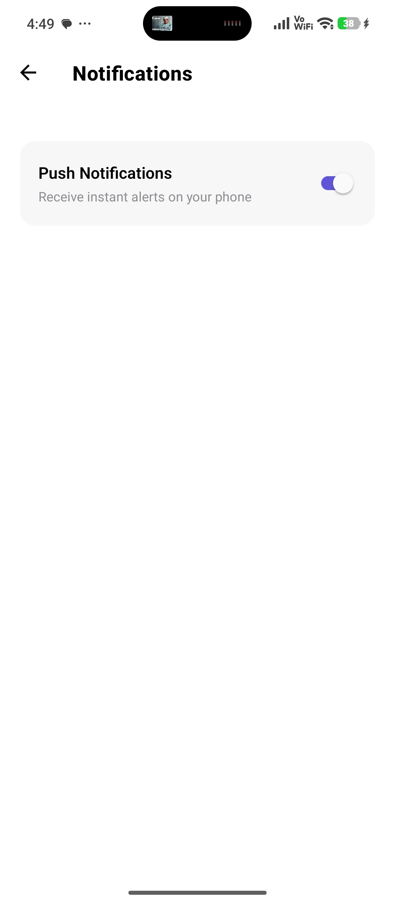</td>
    </tr>
    <tr> 
        <td align="center"><b>Language Dark</b></td> 
        <td align="center"><b>Language Light</b></td> 
        <td align="center"><b>Privacy Policy Dark</b></td> 
        <td align="center"><b>Privacy Policy Light</b></td> 
    </tr> 
    <tr> 
        <td></td>
        <td>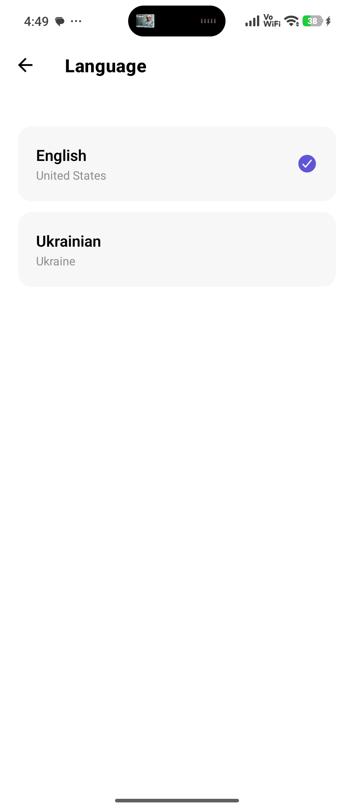</td>
        <td>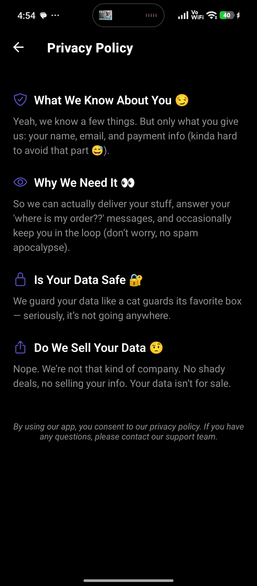</td>
        <td>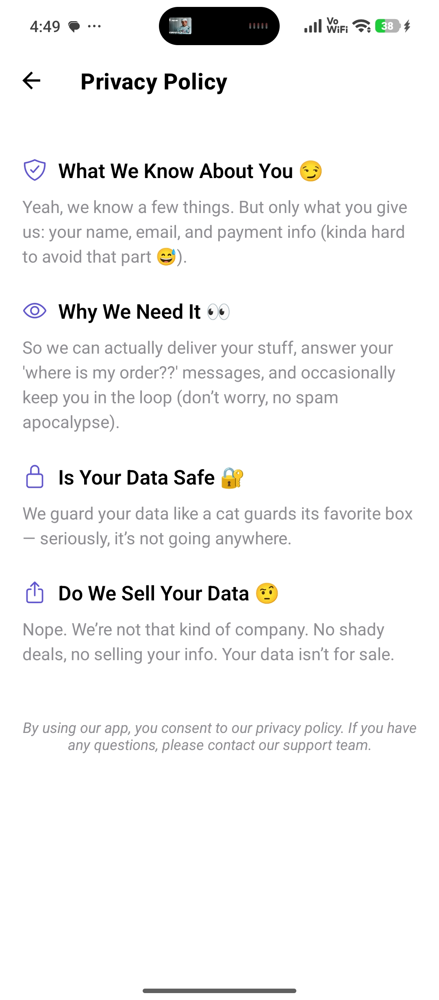</td>
    </tr>
    <tr> 
        <td align="center"><b>Help Center Dark</b></td> 
        <td align="center"><b>Help Center Light</b></td> 
        <td align="center"><b>About Us Dark</b></td> 
        <td align="center"><b>About Us Light</b></td> 
    </tr> 
    <tr> 
        <td>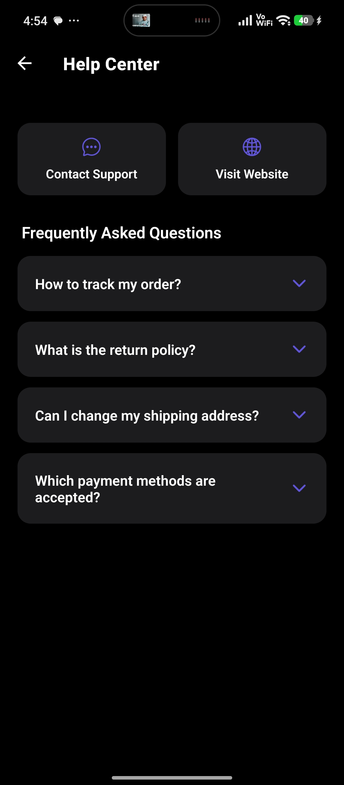</td>
        <td>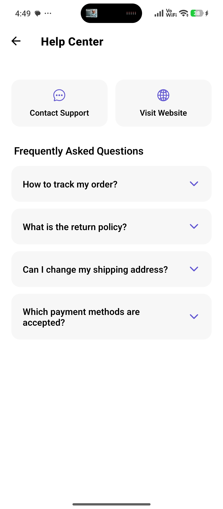</td>
        <td>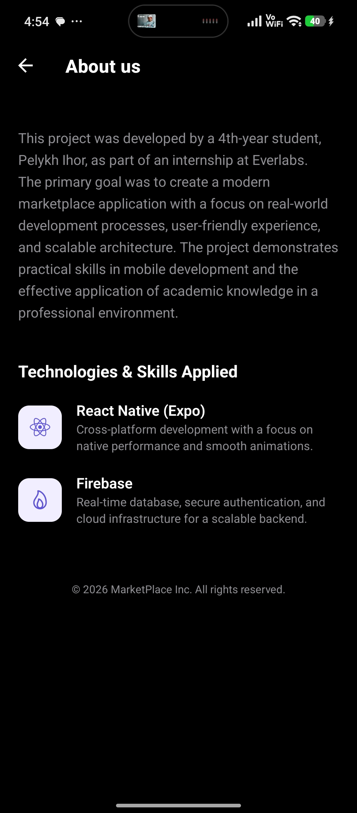</td>
        <td>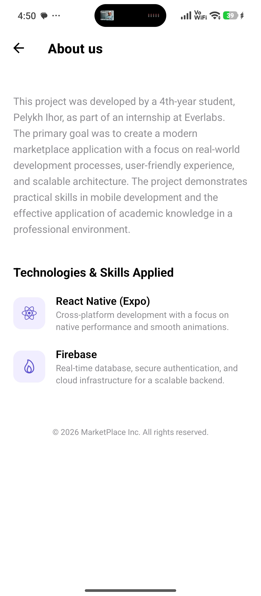</td>
    </tr>
</table>