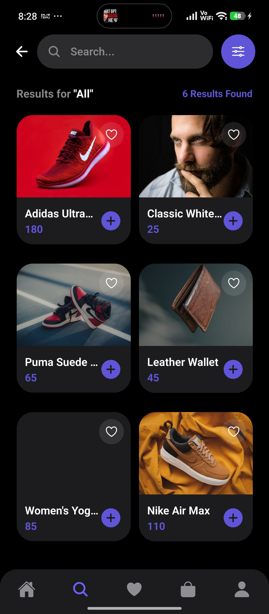
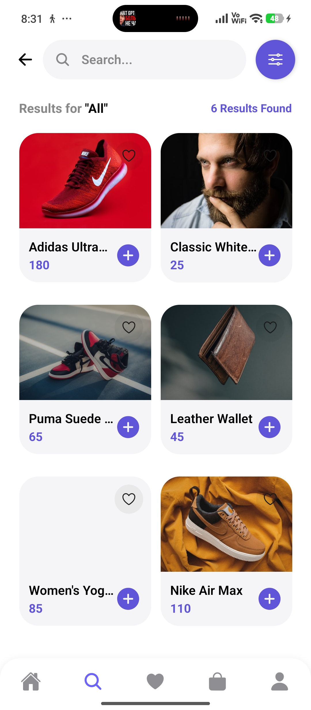
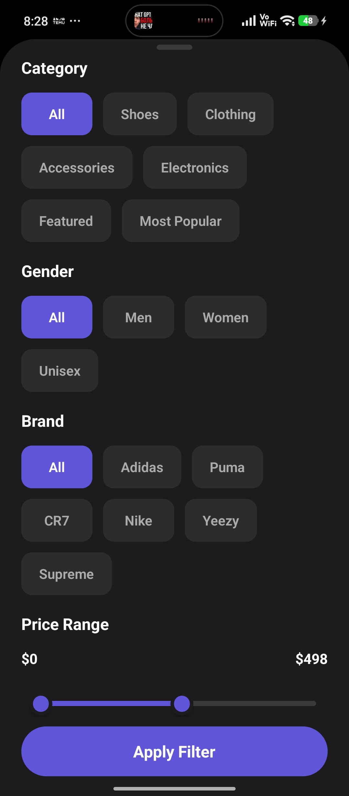
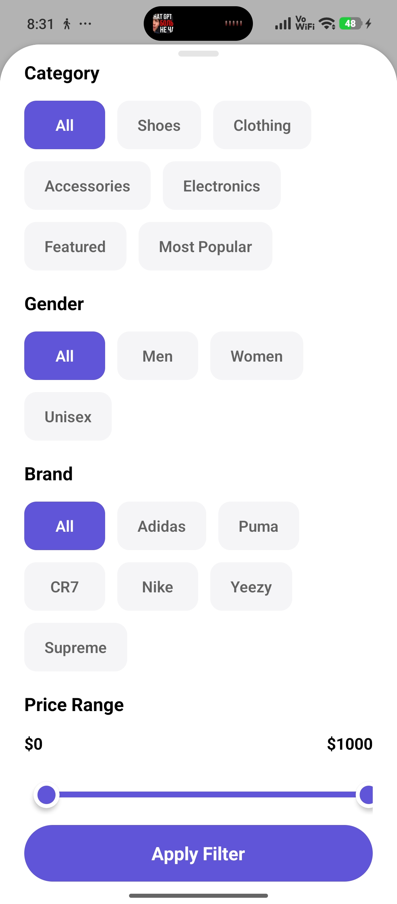
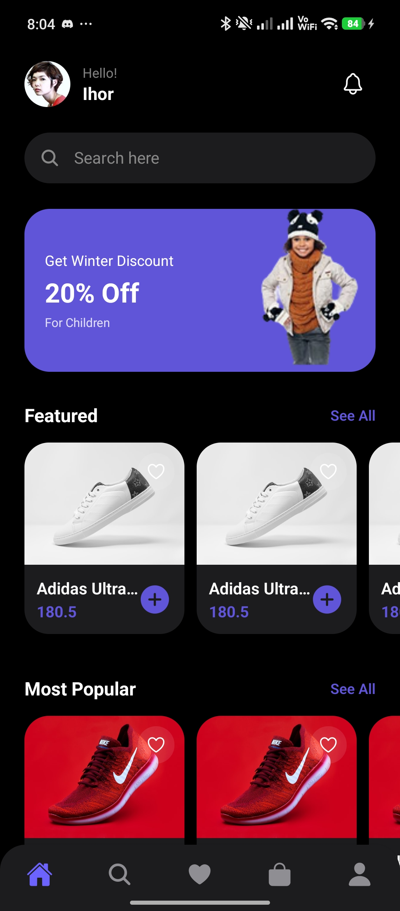
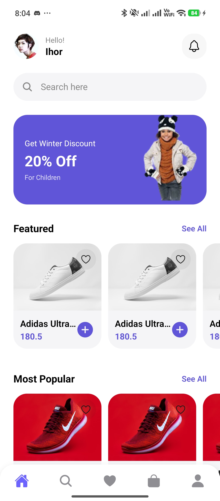
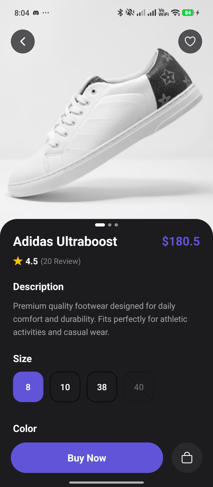
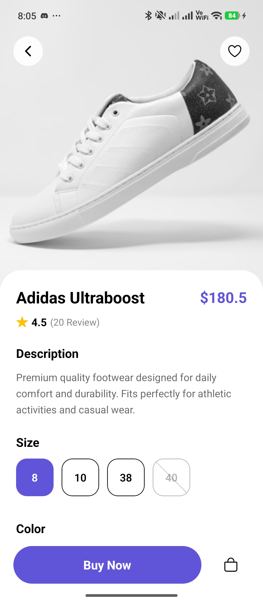

# 👟 Expo Marketplace Practice

Мобільний маркетплейс на **Expo SDK 54**. Практичний проєкт для освоєння архітектури, UI/UX та типізованої валідації в React Native.

**Stack:** Expo SDK 54 · Expo Router · Firebase v12 · React Hook Form · Zod · Reanimated · TypeScript

---

## 📋 Зміст
- [Ключові фічі](#ключові-фічі)
- [Журнал змін](#журнал-змін)
- [Скріншоти](#скріншоти)

---

## Ключові фічі

| Область | Що реалізовано |
|---------|----------------|
| 🔐 Auth | Email/Password + Google via Firebase. Auth Guard на рівні роутера. Persistent sessions через AsyncStorage |
| 🛡 Валідація | Zod-схеми + React Hook Form. Real-time підсвітка помилок у полях |
| 🎨 Теми | Автоматична Dark/Light тема через системний колірний режим |
| 🗺 Навігація | File-based routing (Expo Router). Групи: `(auth)`, `(tabs)`, `(settings)`, `(support)`, `(profile-extra)` |

---

## Журнал змін

> 🟢 — Останній коміт · 🔴 — Попередні етапи · Читається зверху вниз (нове → старе)

---

### 🟢 [28.04.2026] Favorites · Profile · Payment Card · My Orders · Support Screens · Refactoring

**Що зроблено:** Реалізовано екран обраного, редагування профілю, управління картою оплати, екран замовлень, екрани Contact Us / Share App / Help та рефакторинг монолітних компонентів.

---

#### Рішення та обґрунтування

**💳 Payment Card: Живе прев'ю та маскування**
- **Рішення:** Створено `PaymentCardModal` з візуальною картою, що оновлюється в реальному часі. Використано кастомні хелпери для форматування номера (4-4-4-4) та терміну дії (MM/YY).
- **Рефакторинг:** Файл скорочено з 363 до 115 рядків шляхом винесення стилів у `.styles.ts` та логіки у `utils/cardUtils.ts`.
- **Чому саме так:** Це забезпечує преміальний UX (користувач бачить свою карту) без захаращення коду екрана.

**🗂 Чиста архітектура компонентів**
- **Проблема:** Файли ставали занадто великими (>300 рядків), що ускладнювало огляд.
- **Рішення:** Перехід до структури "Компонент + Стилі + Утиліти". Кожен великий UI-блок тепер має свій файл стилів.
- **Чому саме так:** Стандарт розробки великих проектів, що спрощує паралельну роботу та тестування.

**📋 Favorites: swipe-to-delete + move-to-cart**
- **Рішення:** `ReanimatedSwipeable` для видалення, окрема кнопка `bag-add` для переміщення в кошик замість лічильника кількості.
- **Чому саме так:** На екрані Favorites зміна кількості — зайва дія; логічніший flow — вирішити "брати чи ні" і одразу переходити в кошик.
- **Компроміс:** Переміщення в кошик поки симулюється видаленням зі списку — потрібен глобальний cart state.

**🗂 Component extraction: монолітний файл 529 рядків → 3 компоненти**
- **Проблема:** `profile-details.tsx` містив inline-типи, JSX двох модалів, стилі та бізнес-логіку — 529 рядків в одному файлі.
- **Рішення:** Виділено три компоненти з чіткою відповідальністю:
  - `ProfileFieldRow` — рядок редагованого поля + спільні типи (`EditableField`, `UserProfile`, `FIELD_META`)
  - `EditModal` — bottom-sheet модал для редагування одного поля
  - `ChangePasswordModal` — самодостатній модал зміни пароля з власним локальним станом
- **Чому саме так:** Кожен компонент можна тестувати та замінювати ізольовано. `ChangePasswordModal` сам керує своїм станом — батьківський екран передає лише `visible` + `onClose`.
- **Компроміс:** `EditableField` / `FIELD_META` живуть у `ProfileFieldRow.tsx`, а не в окремому `types/`-файлі — достатньо для поточного масштабу.

**🔒 ChangePasswordModal: клієнтська валідація**
- Три поля (current / new / confirm), кожне з окремим `show/hide` toggle.
- Послідовна валідація: пусте поле → довжина < 6 → mismatch → Firebase call.
- **Чому не `useReducer`:** 3 поля + 3 boolean — ще в межах `useState` без надмірного ускладнення.

**👁 Favorites: приховано tab bar**
- `tabBarStyle: hiddenTabBarStyle` в `_layout.tsx` для маршруту `favorites` — аналогічно до `cart`, `products`, `checkout`.
- **Чому:** Favorites є фокусним екраном (вибір/відбір товарів), нижня навігація відволікає.

**📦 My Orders: 3 таби статусу**
- **Рішення:** Екран замовлень з табами Active / Completed / Cancel. Кнопка дії змінюється залежно від статусу (Track Order / Re-Order / Order Again).
- **Чому саме так:** Стандартний e-commerce патерн розділення замовлень за статусом.

**📩 Support Screens: Contact · Share**
- **Contact Us:** 5 методів зв'язку (Phone, Email, WhatsApp, Instagram, Twitter) з нативним `Linking.openURL`. Розклад робочих годин та адреса офісу.
- **Share App:** Простий екран з нативним `Share` API — одна кнопка для шерінгу посилання на додаток.
- **Чому саме так:** Нативні API замість веб-в'ю — кращий UX на мобільних.

**📖 Консолідація Help**
- **Проблема:** Help був доступний з двох місць (Profile та Settings) як два окремі екрани.
- **Рішення:** Видалено `(support)/help.tsx`. Обидва маршрути тепер ведуть на єдиний `(settings)/help-center.tsx`.
- **Чому саме так:** Одне джерело правди для допомоги — немає ризику розсинхрону.

---

#### Змінені файли

| # | File | What changed |
|---|------|--------------|
| 🆕 | `app/(tabs)/favorites.tsx` | Екран обраного: swipe-видалення, кнопка "в кошик", empty state |
| 🔄 | `app/(tabs)/_layout.tsx` | Приховано tab bar для `favorites` |
| 🆕 | `app/(profile-extra)/profile-details.tsx` | Повноцінний екран (160 рядків) — orchestrator поверх компонентів |
| 🆕 | `components/profile/ProfileFieldRow.tsx` | Рядок редагованого поля + типи `EditableField`, `UserProfile`, `FIELD_META` |
| 🆕 | `components/EditModal.tsx` | Bottom-sheet модал редагування поля |
| 🆕 | `components/profile/ChangePasswordModal.tsx` | Самодостатній модал зміни пароля з валідацією |
| 🆕 | `components/profile/PaymentCardModal.tsx` | Модал редагування картки з живим прев'ю та форматуванням |
| 🔄 | `app/(tabs)/orders.tsx` | Повноцінний екран замовлень з 3 табами та картками товарів |
| 🔄 | `app/(tabs)/_layout.tsx` | Приховано tab bar для `favorites` та `orders` |
| 🔄 | `constants/products.ts` | Додано `OrderItem`, `OrderStatus`, `MOCK_ORDERS` |
| 🔄 | `app/(support)/contact.tsx` | Контакти: 5 методів зв'язку, графік роботи, адреса |
| 🔄 | `app/(support)/share.tsx` | Share App: нативний Share API, кнопка шерінгу |
| ❌ | `app/(support)/help.tsx` | Видалено — консолідовано в `(settings)/help-center.tsx` |
| 🔄 | `app/(support)/_layout.tsx` | Прибрано маршрут `help` |
| 🔄 | `app/(tabs)/profile.tsx` | Help веде на `/help-center` замість `/help` |

#### Заплановано
- [ ] Підключити cart state — переміщення з Favorites до Cart без видалення зі списку
- [ ] Firebase `updatePassword` у `ChangePasswordModal.handleSave`
- [ ] Вибір фото профілю (Image Picker)
- [ ] Favorites persistence (AsyncStorage або Firebase)
- [ ] Деталізація замовлення (окремий екран при натисканні Track Order)

---

### 🔴 [24.04.2026 - 26.04.2026] UI Responsiveness · Security · Refactoring · Navigation · Catalog · Cart/Checkout

**Що зроблено:** Об'єднано системний рефакторинг адаптивності й безпеки з новим продуктовим флоу (`Search`, `Products`, `Cart`, `Checkout`), оновленою навігацією каталогу, чисткою auth-модуля та переходом на строгу типізацію (видалення `any`).

---

#### Рішення та обґрунтування

**🔤 Глобальна підтримка SafeAreaView**
- **Проблема:** Відступи від статус-бару робилися вручну через жорсткі `paddingTop`, що некоректно працювало на різних пристроях.
- **Рішення:** Обгортання додатку в `SafeAreaProvider` та використання кастомного `SafeAreaView` з `components/Themed.tsx` замість звичайного `View`.
- **Чому саме так:** `react-native-safe-area-context` автоматично вираховує точні системні відступи (insets) для кожної платформи.

**🔤 Динамічні розміри екрана замість статичних**
- **Проблема:** Використання статичного `Dimensions.get('window')` не реагує на зміну орієнтації екрана або перемикання спліт-скріну.
- **Рішення:** Заміна всіх викликів `Dimensions.get` на React Hook `useWindowDimensions()`.
- **Чому саме так:** Хук автоматично тригерить ре-рендер при зміні розмірів екрана, роблячи UI адаптивним у реальному часі.

**🔤 Безпечне зберігання ключів Firebase та Google**
- **Проблема:** Хардкод секретних ключів та Client ID безпосередньо у вихідному коді створює ризики безпеки при публікації репозиторію.
- **Рішення:** Винесення всіх конфігурацій Firebase та Google Auth у файл `.env` з префіксом `EXPO_PUBLIC_` та додавання його у `.gitignore`.
- **Чому саме так:** Стандартна практика розробки для збереження секретів локально та автоматичної ін'єкції під час збірки (EAS Build / Metro).

**🔤 Міграція з TouchableOpacity на Pressable**
- **Проблема:** Використання `TouchableOpacity`, який має обмежені можливості кастомізації стану натискання та вважається менш гнучким.
- **Рішення:** Глобальна заміна `TouchableOpacity` на `Pressable`. Анімація натискання (зменшення opacity) тепер реалізована через передачу функції у `style={({ pressed }) => [...]}`. Виправлено баг з колапсом розмірів зображень у `FlashList` через відсутність явних `width/height` у нового контейнера.
- **Чому саме так:** `Pressable` є сучасним стандартом React Native. Він дає доступ до станів `pressed`, `hovered`, дозволяє точніше налаштовувати Hit Slop та є більш продуктивним.

**🔤 Покращення UI/UX та рефакторинг компонентів**
- **Рішення:** Створення універсального компонента `VariantSelector`, який підтримує два режими: текстовий (для розмірів) та колірний (візуальні плашки з кольором та індикацією вибору). Видалення зайвих 100 рядків коду з екрана деталей товару.
- **Чому саме так:** Покращує UX (користувач бачить колір, а не читає його назву) та робить код екрана деталей товару чистішим та легшим для підтримки.

**🔤 Редизайн соціальної авторизації**
- **Проблема:** Громіздка кнопка "Continue with Google" займала багато місця та не дозволяла зручно додати інші методи входу (Facebook, Telegram).
- **Рішення:** Створення компактного компонента `SocialIconButton` (тільки іконка) та групування методів авторизації в один рядок.
- **Чому саме так:** Більш сучасний вигляд (UI), економія вертикального простору на екранах входу/реєстрації та легке масштабування для нових методів.

**🔤 Оптимізація сітки фільтрів (SelectionGrid)**
- **Проблема:** Чіпси фільтрів мали різну ширину через внутрішні відступи, що створювало "рваний" вигляд сітки.
- **Рішення:** Перехід на `flexBasis: '31%'` та `flexGrow: 1` для елементів сітки.
- **Чому саме так:** Гарантує рівну сітку по 3 елементи в ряд. `flexGrow` дозволяє останньому елементу в ряду гарно заповнювати простір.

**🔤 Вирівнювання та рефакторинг слайдера ціни (PriceRangeSlider)**
- **Проблема:** Підписи цін та крайні положення повзунків виходили за межі лінії треку, а складна математика координат була розкидана між файлами.
- **Рішення:** Впроваджено `THUMB_OFFSET` (9px) для точного позиціонування візуального центру кульки. Компонент зроблено повністю самодостатнім (ізоляція SharedValues та Gesture всередині).
- **Чому саме так:** Покращення візуальної симетрії (нуль та максимум тепер стоять точно над краями лінії) та спрощення коду на ~94 рядки (−30%) без втрати 60fps плавності.

**🔤 Динамічний PromoBanner з пагінацією**
- **Проблема:** Промо-банер на головному екрані був статичним та захардкодженим, що не дозволяло показувати кілька акцій.
- **Рішення:** Створення окремого компонента `PromoBanner` з підтримкою горизонтальної пагінації та активними індикаторами (dots); пізніше оновлено на відображення по 1 банеру на екран із paging.
- **Чому саме так:** Дозволяє гнучко додавати нові акційні банери через `MOCK_BANNERS` і дає передбачуваний UX скролу.

**🧭 Розділення Search і Products**
- **Проблема:** Один екран одночасно виконував роль пошуку і каталогу, через що сценарії змішувалися.
- **Рішення:** Виділено окремий екран `Products` з власним списком, категоріями та кнопкою фільтрів.
- **Чому саме так:** Розділення відповідальностей спрощує UX і масштабування логіки.
- **Компроміс:** Частина фільтраційної логіки тимчасово дублюється між `search.tsx` і `products.tsx`.

```text
Home
 ├─ Search input -> /search
 ├─ Category chips -> /products?category=...
 └─ Section "See All" -> /products?category=...
```

**🛒 Cart: swipe-to-delete без підтвердження**
- **Проблема:** Видалення через окрему кнопку-смітник збільшувало кількість дій.
- **Рішення:** Замінено на swipe вліво з автоматичним видаленням (`onSwipeableOpen`).
- **Чому саме так:** Це швидше для користувача і відповідає патерну e-commerce кошика.
- **Компроміс:** Наразі немає Undo-дії після видалення.

**🧱 Спрощення структури Cart Summary**
- **Проблема:** Повторювані рядки summary у `cart.tsx` ускладнювали читабельність.
- **Рішення:** Винесено рядок summary в окремий компонент `SummaryRow`, а блок `Order Summary` залишено інлайн у `cart.tsx`.
- **Чому саме так:** Зберігається чиста структура основного екрана без зайвої обгортки та мінімізується дублювання.

**💳 Checkout як окремий крок**
- **Проблема:** Після кошика не було завершеного флоу оформлення.
- **Рішення:** Додано екран `checkout.tsx` з адресою, summary та вибором методу оплати.
- **Чому саме так:** Відокремлений checkout дозволяє розширювати оплату/доставку без ускладнення `cart.tsx`.
- **Компроміс:** Дані summary у checkout поки статичні, без синхронізації зі станом кошика.

**🧩 Керування tabbar для фокусних екранів**
- **Проблема:** Нижній tabbar відволікав на `cart`, `products`, `checkout`.
- **Рішення:** Приховано tabbar для цих роутів у `app/(tabs)/_layout.tsx`.
- **Чому саме так:** Краще фокусує користувача на завершенні поточного сценарію.
- **Компроміс:** Швидкий перехід в інші таби з цих екранів недоступний.

**🧹 Рефакторинг auth-екранів: спільні стилі та видалення мертвого коду**
- **Проблема:** Екрани `login.tsx`, `register.tsx` та `forgot-password.tsx` мали ~70% ідентичних стилів (container, header, divider, footer, error тощо). У `register.tsx` лишались невикористані стейти `error` та `notFound` (скопійовані з login і забуті). У `forgot-password.tsx` — аналогічний мертвий `notFound`.
- **Рішення:** Створено єдиний файл `constants/authStyles.ts` зі спільними стилями. Локальні `StyleSheet.create` у `register.tsx` та `forgot-password.tsx` повністю видалені; у `login.tsx` залишено тільки 3 унікальні стилі (`errorLink`, `forgotPassword`, `forgotText`). Видалено мертвий код.
- **Чому саме так:** Єдине джерело для візуального стилю auth-потоку. Зміна кольору, відступу чи шрифту тепер робиться в одному місці.

**🐛 Виправлення бага: `forgot-password.tsx` не показував помилки**
- **Проблема:** Серверна помилка (`serverError`) ловилась у `catch`-блоці та записувалась у стейт, але ніде не рендерилась у JSX. Користувач не бачив повідомлення про помилку при невірному email.
- **Рішення:** Додано блок `{serverError ? <ServerError /> : null}` між полем вводу та кнопкою "Send Reset Link".
- **Чому саме так:** Стандартний патерн відображення помилок, вже використаний у `login.tsx` та `register.tsx`.

**🔤 Виправлення тексту в Zod-схемі**
- **Проблема:** У `schemas/authSchema.ts` повідомлення валідації містило помилку: `"must ne"` замість `"must be"`.
- **Рішення:** Виправлено на `"Full name must be at least 2 characters"`.

**🛡️ Строга типізація (TypeScript)**
- **Проблема:** У багатьох компонентах (`AppInput`, `AppButton`, `SettingsItem`, `FiltersSheet` тощо) та екранах використовувався тип `any`, що знижувало надійність коду та викликало потенційні проблеми з підтримкою.
- **Рішення:** Проведено глобальну заміну `any` на специфічні типи. Додано інтерфейси для props (наприклад, `NotificationOptionProps`, `FAQItemProps`, `FilterOptions`). Використано `keyof typeof Ionicons.glyphMap` для іконок та `unknown` з тайп-кастингом для помилок у `catch` блоках.
- **Чому саме так:** Стандарт індустрії. Покращує автодоповнення (IntelliSense) у редакторі, допомагає уникати runtime-помилок і робить код самодокументованим.

---

#### Змінені файли

| # | File | What changed |
|---|------|--------------|
| 🆕 | `.env` | Файл конфігурації зі змінними середовища |
| 🔄 | `app/_layout.tsx` | Додано `SafeAreaProvider` у кореневий layout |
| 🔄 | `components/Themed.tsx` | Створено тематичний `SafeAreaView` з підтримкою dark/light modes |
| 🔄 | `app/**/*.tsx` (21 файл) | Масова заміна кореневого `View` на `SafeAreaView` та видалення зайвих `paddingTop` |
| 🔄 | `components/ui/PriceRangeSlider.tsx` | Повний рефакторинг: компонент став самодостатнім, виправлено позиціонування та вирівнювання цін |
| 🔄 | `components/FiltersSheet.tsx` | Спрощено логіку (видалено математику координат), впроваджено 3-колонкову сітку для чіпсів |
| 🔄 | `app/(tabs)/index.tsx` | Рефакторинг: винесено промо-банер в окремий компонент |
| 🆕 | `components/PromoBanner.tsx` | Новий компонент для гортання рекламних банерів з точками-індикаторами |
| 🔄 | `constants/products.ts` | Додано інтерфейс `BannerItem` та масив `MOCK_BANNERS` |
| 🔄 | `constants/firebase.ts` | Заміна захардкоджених значень на `process.env.EXPO_PUBLIC_*` |
| 🔄 | `hooks/useGoogleAuth.ts` | Підключення Client ID через змінні середовища |
| 🔄 | `.gitignore` | Додано ігнорування `.env` файлу |
| 🔄 | `components/**/*.tsx`, `app/**/*.tsx` | Глобальна заміна `TouchableOpacity` на `Pressable` з налаштуванням стилів через стан `pressed` |
| 🆕 | `components/ui/VariantSelector.tsx` | Універсальний компонент для вибору варіантів (розмір/колір) |
| 🔄 | `app/(tabs)/product-details/[id].tsx` | Рефакторинг: впровадження `VariantSelector` та видалення ~100 рядків зайвого коду |
| 🆕 | `components/ui/SocialIconButton.tsx` | Компактна кнопка соцмереж (Google, Facebook, Telegram) |
| 🔄 | `app/(auth)/login.tsx`, `register.tsx` | Впровадження рядка соціальних іконок замість великої кнопки |
| ❌ | `components/ui/GoogleButton.tsx` | Видалено (замінено на `SocialIconButton`) |
| 🆕 | `app/(tabs)/products.tsx` | Окремий екран каталогу з категоріями та фільтрами |
| 🆕 | `app/(tabs)/checkout.tsx` | Новий екран оформлення замовлення |
| 🔄 | `app/(tabs)/cart.tsx` | Swipe-to-delete, новий header, перехід у checkout, inline Order Summary |
| 🔄 | `app/(tabs)/_layout.tsx` | Приховано tabbar для `cart`, `products`, `checkout` |
| 🔄 | `constants/products.ts` | Винесено `CartItem` та `INITIAL_CART` |
| 🆕 | `components/SummaryRow.tsx` | Універсальний рядок для summary-блоків (label/value) |
| 🆕 | `constants/authStyles.ts` | Спільні стилі для auth-екранів (container, header, error, divider, footer) |
| 🔄 | `app/(auth)/login.tsx` | Перехід на `authStyles`, видалення ~60 рядків дубльованих стилів |
| 🔄 | `app/(auth)/register.tsx` | Видалення мертвого коду (`error`, `notFound`), повний перехід на `authStyles` |
| 🐛 | `app/(auth)/forgot-password.tsx` | Виправлено баг: додано рендер `serverError`, видалено мертвий `notFound`, перехід на `authStyles` |
| 🔄 | `schemas/authSchema.ts` | Виправлено текст у повідомленні валідації |
| 🛡️ | `components/**/*.tsx`, `app/**/*.tsx` | Повна відмова від `any` на користь строгих типів (interfaces, type casting, `unknown` для помилок) |

#### Заплановано
- [ ] Винесення повторюваних елементів (банери, стрічка пошуку) в окремі UI-компоненти.
- [ ] Налаштування EAS Secrets для CI/CD збірок.
- [ ] Підключити checkout до реального стану кошика (items/subtotal/total).
- [ ] Додати Undo після swipe-видалення товару з кошика.
- [ ] Довести нові екрани до повної dark/light parity без hardcoded кольорів.

---

### 🔴 [22.04.2026] Advanced Search · Filters · Modular Refactoring · Code Style
    
**Що зроблено:** Створення повноцінної системи пошуку та фільтрації товарів (Search Flow) з централізацією констант, використанням нативних анімацій, рефакторингом компонентів та глобальним оновленням стилю коду.

---

#### Рішення та обґрунтування

**🔍 Реалізація пошуку та фільтрації**
- **Проблема:** Повна відсутність інструментів для знаходження товарів за назвою, категорією або ціною.
- **Рішення:** Створення екрана пошуку з глобальною фільтрацією та винос додаткових параметрів у Bottom Sheet (`ActionSheet`).
- **Чому саме так:** Це дозволяє тримати інтерфейс чистим для швидкого пошуку, надаючи розширені можливості лише за запитом користувача.

**⚡ Price Slider (Reanimated 3)**
- **Проблема:** Дьоргання ціни при оновленні через React state під час руху повзунка.
- **Рішення:** Використання `SharedValues` та логіки `translationX`. Оновлення ціни відбувається в нативному потоці через `AnimatedTextInput`.
- **Чому саме так:** Забезпечує стабільні 60 FPS, роблячи взаємодію з ціною максимально гладкою.

**🏗 Модульний рефакторинг шторки**
- **Проблема:** Шторка фільтрів стала занадто складною для розміщення в одному файлі.
- **Рішення:** Винесення логіки слайдера в окремий компонент `PriceRangeSlider.tsx`.
- **Чому саме так:** Дозволяє ізолювати складну математику анімацій та покращити читабельність основного файлу `FiltersSheet.tsx`.

**🏢 Централізація даних (Single Source of Truth)**
- **Проблема:** Незручність управління розрізненими масивами опцій для фільтрів.
- **Рішення:** Винесення всіх констант (`PRODUCT_CATEGORIES`, `BRAND_OPTIONS`, `COLOR_OPTIONS`) в єдиний файл `constants/products.ts`.
- **Чому саме так:** Забезпечує легкість масштабування та одну точку правки для всіх параметрів фільтрації.

**🌓 Адаптація під світлу/темну теми**
- **Проблема:** Стандартні елементи вводу не завжди коректно відображають текст при зміні системної теми.
- **Рішення:** Динамічне керування кольорами тексту та фону через хук `useThemeColor`.

**⚡ UX: Автофокус при переході**
- **Рішення:** Використання `autoFocus={true}` при ініціалізації екрана пошуку.
- **Чому саме так:** Зменшує кількість дій користувача, дозволяючи почати ввід тексту одразу після відкриття пошуку.

**💎 Глобальне форматування**
- **Рішення:** Перехід на використання табуляції у всіх файлах проекту.
- **Причина:** Просто так.

---

#### Змінені файли

| # | Файл | Зміна |
|---|------|-------|
| 🆕 | `components/ui/PriceRangeSlider.tsx` | Високопродуктивний компонент слайдера цін |
| 🆕 | `app/(tabs)/search.tsx` | Екран пошуку з інтеграцією фільтрів |
| 🔄 | `components/FiltersSheet.tsx` | Рефакторинг шторки фільтрів |
| 🔄 | `constants/products.ts` | Централізація опцій фільтрації та мок-даних |
| 🏁 | Глобально | Оновлення табуляції у всіх файлах проекту |

#### Заплановано
- [ ] Збереження історії останніх пошукових запитів
- [ ] Оптимізація списків товарів
- [ ] Додавання скелетонів для завантаження

---

### 🔴 [21.04.2026] Home Screen · Product Details · Image Gallery

**Що зроблено:** Головний екран із горизонтальними слайдерами + повноцінний екран деталей товару (галерея, зум, вибір розміру, bottom bar) + інструкція для ШІ для документації.

---

#### Рішення та обґрунтування

**🔄 FlashList замість Carousel**
- **Проблема:** `react-native-reanimated-carousel` спричиняв дьоргання інтерфейсу при скролі.
- **Рішення:** `@shopify/flash-list` — рендерить тільки видимі елементи, не конфліктує з жестами вкладених `ScrollView`.
- **Компроміс:** Останній елемент слайдера поки не обрізається краєм екрана — виправлю окремо.

**🖼 Галерея на екрані деталей**
- `FlashList` з `pagingEnabled` → посторінковий горизонтальний свайп між фото.
- Dots-індикатор: активна крапка розширюється до `width: 18` (стандартний патерн).
- Поточний індекс відстежується через `onMomentumScrollEnd`.
- **Чому FlashList, а не FlatList?** Відсутність конфліктів жестів при вкладенні в зовнішній `ScrollView`.

**🔍 Зум зображення**
- Тап на фото → `Modal` з `react-native-image-pan-zoom` (pinch / pan / double-tap).

**🔢 OptionSelector (вибір розміру)**
- Винесено в окремий компонент для подальшого повторного використання.
- Недоступні розміри: `opacity: 0.3` + діагональна лінія поверх елемента.

**📦 Зміна інтерфейсу `ProductItem`**
```ts
// Було
image: string

// Стало — зворотна сумісність збережена
image: string     // картки на головному екрані (без змін)
images: string[]  // галерея на екрані деталей (нове поле)
```

---

#### Змінені файли

| # | Файл | Зміна |
|---|------|-------|
| 🆕 | `app/(tabs)/index.tsx` | Головна сторінка, FlashList слайдери |
| 🆕 | `app/(tabs)/product-details/[id].tsx` | Екран деталей товару |
| 🔄 | `components/ProductCard.tsx` | Адаптація під горизонтальні списки |
| 🔄 | `constants/products.ts` | Поле `images: string[]` в інтерфейсі та моках |
| 🔄 | `package.json` | + `@shopify/flash-list`, + `react-native-image-pan-zoom` |

#### Заплановано
- [ ] Обрізка останнього елемента слайдера краєм екрана
- [ ] Промо-банери: перехід на динамічне управління з БД (4 варіанти дизайну)

---

### 🔴 [20.04.2026] Auth Validation & Refactoring

**Що зроблено:** Клієнтська валідація авторизаційного флоу через зв'язку React Hook Form + Zod.

---

#### Рішення та обґрунтування

**🛡 Zod замість ручної валідації**
- **Чому Zod?** Схеми автоматично генерують TypeScript-типи через `z.infer` — один source of truth для валідації і типізації одночасно.
- Централізовані правила: `emailRule`, `passwordRule` (мін. 6 символів + обов'язкова цифра в `registerSchema`).

**📋 React Hook Form + Controller**
- `useForm` з `@hookform/resolvers/zod` → Zod-схема напряму підключається як resolver.
- `<Controller />` зв'язує UI-компоненти з формою без зайвих ре-рендерів (на відміну від `useState` на кожне поле).

**🔴 Real-time feedback в `AppInput`**
- Доданий проп `error?: string`.
- При помилці валідації: червоний border + текст підказки з'являються миттєво, без сабміту форми.

---

#### Змінені файли

| # | Файл | Зміна |
|---|------|-------|
| 🆕 | `schemas/authSchema.ts` | Zod-схеми для login / register / forgot-password |
| 🆕 | `app/(tabs)/favorites.tsx` | Екран обраного |
| 🆕 | `hooks/useGoogleAuth.ts` | Заглушка-хук для Google Auth |
| 🔄 | `app/(auth)/login.tsx` | Рефакторинг форми під RHF + Zod |
| 🔄 | `app/(auth)/register.tsx` | Рефакторинг форми під RHF + Zod |
| 🔄 | `app/(auth)/forgot-password.tsx` | Рефакторинг форми під RHF + Zod |
| 🔄 | `components/ui/AppInput.tsx` | Prop `error`, візуалізація помилок |

---

### 🔴 [19.04.2026] Navigation Overhaul & Architecture

**Що зроблено:** Реструктуризація роутингу на Expo Router Groups + Auth Guard.

---

#### Рішення та обґрунтування

**🗺 File-based групи замість ручного Stack**
- Групи `(auth)`, `(tabs)`, `(settings)`, `(support)`, `(profile-extra)` — кожна має свій `_layout.tsx`.
- Це дає ізольовані стеки навігації без prop drilling і без конфліктів між екранами.

**🔒 Auth Guard в `_layout.tsx`**
- Редирект з кореневого `_layout.tsx` залежно від стану `AuthContext`.
- Неавторизований користувач фізично не може потрапити в `(tabs)` — редирект відбувається до рендеру.

**🎨 Рефакторинг `Colors.ts`**
- Перехід до єдиної палітри замість розрізнених значень — основа для консистентної теми по всьому проєкту.

---

#### Змінені файли

| # | Файл | Зміна |
|---|------|-------|
| 🔄 | `app/_layout.tsx` | Redirect logic, Auth Guard |
| 🔄 | `constants/Colors.ts` | Design system палітра |
| 🆕 | `components/SettingsItem.tsx` | Універсальний компонент рядка налаштувань |
| 🆕 | `app/(tabs)/_layout.tsx` | Bottom Tab навігація |
| 🆕 | `app/(auth)/_layout.tsx` | Auth stack |
| 🆕 | `app/(settings)/_layout.tsx` | Settings stack |
| 🆕 | `app/(support)/_layout.tsx` | Support stack |
| 🆕 | `app/(profile-extra)/_layout.tsx` | Profile extra stack |
| 🆕 | `app/(settings)/settings.tsx` | Повноцінний UI, без логіки |
| 🆕 | `app/(settings)/notifications.tsx` | Повноцінний UI, без логіки |
| 🆕 | `app/(settings)/language.tsx` | Повноцінний UI, без логіки |
| 🆕 | `app/(settings)/privacy.tsx` | Повноцінний UI, без логіки |
| 🆕 | `app/(settings)/about-us.tsx` | Повноцінний UI, без логіки |
| 🆕 | `app/(support)/help-center.tsx` | Повноцінний UI, без логіки |
| 🆕 | `app/(tabs)/search.tsx` | Placeholder |
| 🆕 | `app/(tabs)/cart.tsx` | Placeholder |
| 🆕 | `app/(tabs)/orders.tsx` | Placeholder |
| 🆕 | `app/(tabs)/categories.tsx` | Placeholder |
| 🆕 | `app/(support)/contact.tsx` | Placeholder |
| 🆕 | `app/(profile-extra)/profile-details.tsx` | Placeholder |

---

### 🔴 [17.04.2026] Firebase Auth Integration

**Що зроблено:** Підключення Firebase SDK + глобальний стейт авторизації.

---

#### Рішення та обґрунтування

**🔥 Firebase + AsyncStorage Persistence**
- `getReactNativePersistence(AsyncStorage)` → сесія зберігається після перезапуску додатку.
- Ініціалізація винесена в `constants/firebase.ts` — один інстанс на весь проєкт.

**🌐 AuthContext**
- Глобальний контекст замість передачі стану пропами.
- Подписка на `onAuthStateChanged` → UI реагує на зміну авторизації автоматично.

---

#### Змінені файли

| # | Файл | Зміна |
|---|------|-------|
| 🆕 | `context/AuthContext.tsx` | Глобальний стейт авторизації |
| 🆕 | `constants/firebase.ts` | Ініціалізація Firebase |
| 🆕 | `components/ui/GoogleButton.tsx` | UI кнопка Google Sign-In |
| 🔄 | `app/(tabs)/profile.tsx` | Відображення даних юзера + Sign Out |
| ❌ | `app/(auth)/reset-password.tsx` | Видалено — замінено на новий флоу |
| ❌ | `app/(auth)/verify-code.tsx` | Видалено — замінено на новий флоу |

---

### 🔴 [16.04.2026] UI Construction & Components

**Що зроблено:** Базова бібліотека UI-компонентів + конфігурація EAS збірок.

---

#### Змінені файли

| # | Файл | Зміна |
|---|------|-------|
| 🆕 | `components/ui/AppButton.tsx` | Базова кнопка з кастомними стилями |
| 🆕 | `components/ui/BackButton.tsx` | Кнопка назад |
| 🆕 | `components/ui/AppInput.tsx` | Перша версія поля вводу |
| 🆕 | `app/(auth)/forgot-password.tsx` | Базовий UI |
| 🆕 | `app/(auth)/success.tsx` | Базовий UI |
| 🆕 | `eas.json` | EAS конфігурація для Android/iOS |

---

### 🔴 [15.04.2026] Initial Setup & Theme Fixes

**Що зроблено:** Ініціалізація проєкту, чистка дефолтного шаблону, виправлення рендерингу тем.

---

#### Рішення та обґрунтування

**🎨 Фікс білих блоків під текстом (Light тема)**
- Дефолтний шаблон `tabs@54` мав hardcoded кольори в кількох компонентах — замінено на `useColorScheme`-залежні значення.

---

#### Змінені файли

| # | Файл | Зміна |
|---|------|-------|
| 🆕 | `app.json`, `package.json`, `tsconfig.json` | Конфіги проєкту |
| 🆕 | `app/+html.tsx`, `app/+not-found.tsx` | Системні екрани |
| 🆕 | `app/(auth)/login.tsx`, `register.tsx` | Базовий UI |
| 🆕 | `assets/fonts/SpaceMono-Regular.ttf` | Шрифт |
| 🔄 | `components/Themed.tsx` | Фікс тем |
| 🔄 | `components/StyledText.tsx` | Фікс тем |
| 🔄 | `components/useColorScheme.ts` | Фікс тем |
| ❌ | `components/EditScreenInfo.tsx` | Видалено дефолтний шаблон |
| ❌ | `hooks/useClientOnlyValue.ts` | Видалено дефолтний шаблон |
| ❌ | `hooks/useClientOnlyValue.web.ts` | Видалено дефолтний шаблон |
| ❌ | `components/useColorScheme.web.ts` | Видалено дефолтний шаблон |

---

## Скріншоти

### 🔍 Search & Filtering
<table>
    <tr>
        <td align="center"><b>Search Dark</b></td>
        <td align="center"><b>Search Light</b></td>
        <td align="center"><b>Filter Sheet Dark</b></td>
        <td align="center"><b>Filter Sheet Light</b></td>
    </tr>
    <tr>
        <td></td>
        <td></td>
        <td></td>
        <td></td>
    </tr>
</table>

### 🏠 Discovery & Marketplace
<table>
    <tr>
        <td align="center"><b>Home Dark</b></td>
        <td align="center"><b>Home Light</b></td>
        <td align="center"><b>Product Details Dark</b></td>
        <td align="center"><b>Product Details Light</b></td>
    </tr>
    <tr>
        <td></td>
        <td></td>
        <td></td>
        <td></td>
    </tr>
</table>

### 🔐 Auth Flow
<table>
    <tr>
        <td align="center"><b>Login Dark</b></td>
        <td align="center"><b>Login Light</b></td>
        <td align="center"><b>Register Dark</b></td>
        <td align="center"><b>Register Light</b></td>
    </tr>
    <tr>
        <td></td>
        <td></td>
        <td></td>
        <td></td>
    </tr>
    <tr>
        <td align="center"><b>Forgot Password Dark</b></td>
        <td align="center"><b>Forgot Password Light</b></td>
        <td align="center"><b>Success Dark</b></td>
        <td align="center"><b>Success Light</b></td>
    </tr>
    <tr>
        <td></td>
        <td></td>
        <td></td>
        <td></td>
    </tr>
</table>

### 👤 Profile & Details
<table>
    <tr>
        <td align="center"><b>Profile Dark</b></td>
        <td align="center"><b>Profile Light</b></td>
        <td align="center"><b>Profile Details Dark</b></td>
        <td align="center"><b>Profile Details Light</b></td>
    </tr>
    <tr>
        <td></td>
        <td></td>
        <td></td>
        <td></td>
    </tr>
</table>

### ⚙️ Settings & Support
<table>
    <tr>
        <td align="center"><b>Settings Dark</b></td>
        <td align="center"><b>Settings Light</b></td>
        <td align="center"><b>Notifications Dark</b></td>
        <td align="center"><b>Notifications Light</b></td>
    </tr>
    <tr>
        <td></td>
        <td></td>
        <td></td>
        <td></td>
    </tr>
    <tr>
        <td align="center"><b>Language Dark</b></td>
        <td align="center"><b>Language Light</b></td>
        <td align="center"><b>Help Center Dark</b></td>
        <td align="center"><b>Help Center Light</b></td>
    </tr>
    <tr>
        <td></td>
        <td></td>
        <td></td>
        <td></td>
    </tr>
    <tr>
        <td align="center"><b>About Us Dark</b></td>
        <td align="center"><b>About Us Light</b></td>
        <td align="center"><b>Privacy Policy Dark</b></td>
        <td align="center"><b>Privacy Policy Light</b></td>
    </tr>
    <tr>
        <td></td>
        <td></td>
        <td></td>
        <td></td>
    </tr>
</table>
